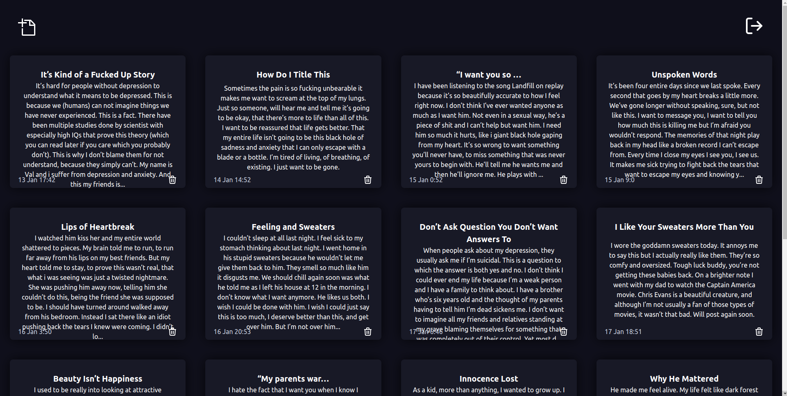
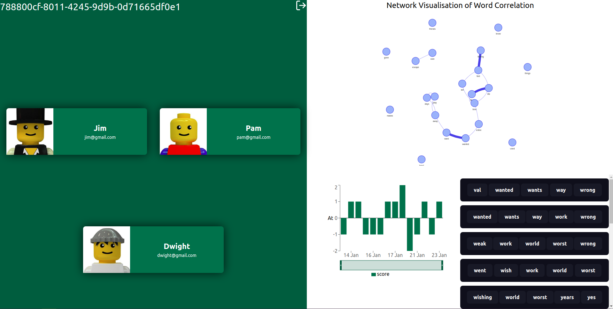
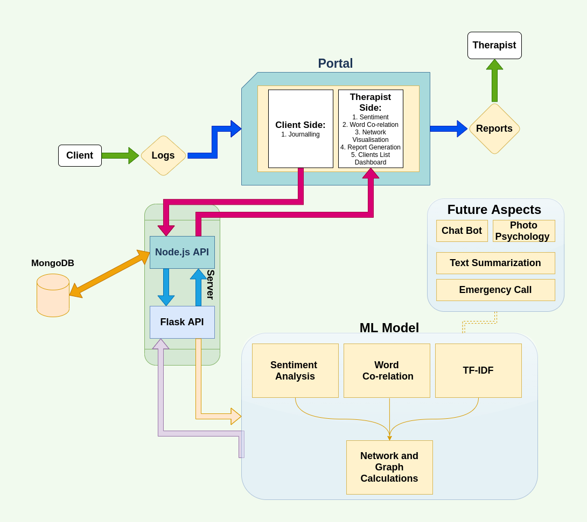

# **FREN** - HackTheMountains'20

#### Assistant to the Therapist

## [Give it a try!](https://gitaalekhyapaul.xyz/)

## A Preview of What Fren Is:

### Write down your experiences:

### Let us help your therapist in helping you!

## Why is Mental health Important?

> Mental illnesses, such as depression and anxiety, affect people’s ability to participate in health-promoting behaviors. In turn, problems with physical health, such as chronic diseases, can have a serious impact on mental health and decrease a person’s ability to participate in treatment and recovery. Mental health conditions will affect a staggering one in four people at some time in their lives. When it comes to our commitments to the rest of the world, people are silent on the issue of mental health.

## Mental Health in 2020

### What the Statistics say

> 1/4 population is affected by a mental or neurological disorder. 50% of lifetime mental illness begins by the age 14, 75% by 24. 5% of adults experience a mental illness equivalent to 43.8 million people. And this is just a fraction of it.

## Let us help,

### To encourage therapy.

**Our Hack of the Hour presents to you a product which is meant to strengthen the relationship between a Therapist & its Client. A product that is meant to channel the Client's emotions and feelings anytime. Providing a detailed analysis, tailored to the Client itself.**

## Features offered by Fren

- ### **Mobile-ready web app**
  - A MERN Web Application ready to be accessed anywhere, anytime.
- ### **Accurate data logging**
  - Reliable entry logging in a Node.js API along with timestamp collection, for analysis of data.
- ### **Sentiment analysis**
  - Receives data through a Flask API, analyses a journal entry to describe The Client's mood. It is a multi-layer perceptron to classify between different moods.
- ### **Word analysis**
  - Scans through the journal entry and highlights the context. It uses Text-Frequency And Inverse Document Frequency to judge how important a word is to the context.
- ### **Network visualisation**
  - To generate a Graph Visualisation of strongly context-related words.

## A Look Into How Fren Works

## WHAT IT DOES

1. **Capture** - The Client writes it's thoughts, feelings, and emotions down in our product.
2. **Calculate** - We take them and perform some magic on it, providing some numbers and comparisons.
3. **Conclude** - The bunny out of the bag is shown to the Therapist, custom to each client to support the process in its entirety.

## Technology Stack and Dependencies

- **ML**
  - sklearn
  - nltk
  - spacy
  - textblob
  - pytorch
- **APIs**
  - Node.js
  - Express in TypeScript
  - MongoDB
  - Flask
- **Front-end**
  - React.js in TypeScript-XML
  - Tailwind CSS

## Future Developments

### Text Summarization

Privacy of the client is extremely essential. However in extreme cases, keeping in mind the well being of the client, the summary of the clients note will be provided to the therapist.

### Chatbot

To make it more user friendly we wish to create an interactive BOT to help the client with his specific needs.

### Photo psychology

Exploration of how clients react to pictures so as to understand their spectrum of emotions.

# Thank You!

<h1 align="center"> Contributors </h1>
<table align="center">
<tr align="center">
<td>
<strong>Abhishek Saxena</strong>

</td>
<td>
<strong>Ansh Sharma</strong>

</td>
<td>
<strong>Saisha Shetty</strong>

</td>
</tr>
</table>
<table align="center">
<tr align="center">
<td>
<strong>Gita Alekhya Paul</strong>

</td>
<td>
<strong>Yashvardhan Jagnani</strong>

</td>
</tr>
</table>
